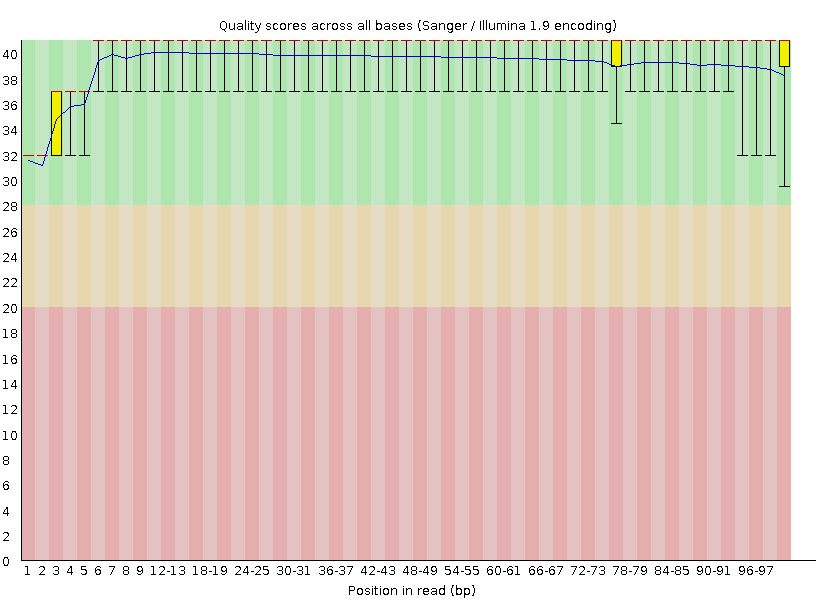
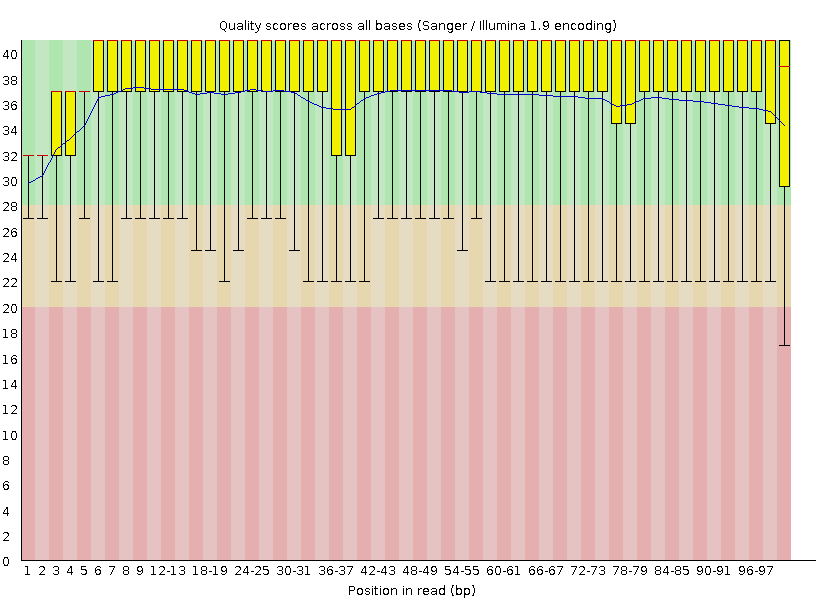
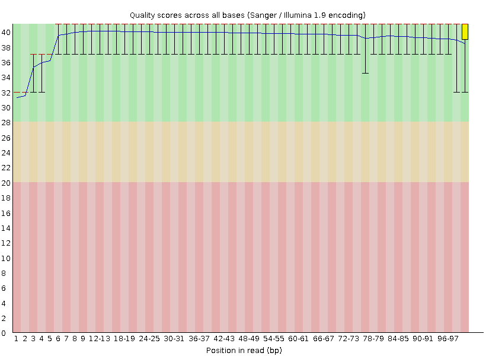
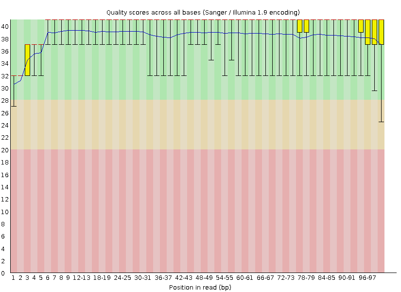

------------------------------------------------------------------------

<center>

<h1>QAA Report</h1>

</center>

<center>

<h3>Sydney Hamilton</h3>

</center>

<center>

<h3>9/15/2023</h3>

</center>

------------------------------------------------------------------------

```{r setup, include=FALSE}
knitr::opts_chunk$set(echo = TRUE)
library(tidyverse)
library(tinytex)


```

<center>

<h1>[Objective]{.underline}</h1>

</center>

**Part 1**

The objective for the assignment was to perform analysis of RNA-seq data using existing tools and my own past tools I created to perform similar tasks. The analysis included adapter trimming and quality assessment of resulting data. The reference genome in this analysis was the common House Mouse (*Mus Musculus*) and the paired end read sequences handled were:\

<center>**7_2E_fox_S6_L008_R1_001.fastq.gz**\
**7_2E_fox_S6_L008_R1_001.fastq.gz**\
**19_3F_fox_S14_L008_R1_001.fastq.gz**\
**19_3F_fox_S14_L008_R2_001.fastq.gz**\
</center>

---

<center>

<h1>[**FastQC Plotting**]{.underline}</h1>

</center>

<center>

<h2>Quality Score Plots: 7_2E_fox_S6_L008_R1_001.fastq.gz</h2>

</center>

------------------------------------------------------------------------
The first step of the process included using FastQC, a quality control tool used for quick analysis of sequence data from high-throughput pipelines. It's generally used to form an impression of the data and whether it is fit for further analysis, which is what I used it for as well. The program is run on the command line or in a script and produces html and zipped files for viewing, the graphs included below are from the html files produced by fastqc on each sequence data.


Figures 1,3,5,7 are quality score plots for each library generated using FastQC. The quality scores generally stay above 30 (using phredscore33 encoding) indicating the data has sufficient quality for further analysis. The beginning of the reads start with relatively low scores as compared to the rest of the run which is a common occurence in RNA-seq.  The quality score for each library trails off when approaching the tail end of the library's sequencing process. This is caused by several factors, one of which is the degradation of flourophores and polymerases also known as signal decay. Another cause of this drop in quality is the failure of nucleotide incorporation also known as phasing. Figures 2,4,6,8 are N content plots generated using FastQC. The N content plots show almost no N content in the entirety of the library sequencing, which is consistent with the quality scores we see in the figures associated.

```{r 7_2E_R1_init, echo=FALSE}
fastqc_7_2E_R1_pic=
fastqc_7_2E_R1_pic_n=knitr::include_graphics("7_2E_R1_fastqc_ncontent.png")

```


```{r 7_2E_R1, echo=FALSE, fig.cap="Figure 1: Quality Score plot of 7-2E-fox-S6-L008-R1-001 read 1.", out.width="1000px"}
fastqc_7_2E_R1_pic
```


```{r 7_2E_R1_n,  echo=FALSE, fig.cap="Figure 2: Quality Score plot of 7-2E-fox-S6-L008-R1-001 read 1.", out.width="1000px"}
fastqc_7_2E_R1_pic_n
```


------------------------------------------------------------------------

<center>

<h2>Quality Score Plots: 7_2E_fox_S6_L008_R2_001.fastq.gz</h2>


</center>

```{r 7_2E_R2_init, echo=FALSE}
fastqc_7_2E_R2_pic=
fastqc_7_2E_R2_pic_n=knitr::include_graphics("7_2E_R2_fastqc_ncontent.png")
```

::: row


::: col-md-6


```{r 7_2E_R2, fig.cap="Figure 3: Quality Score plot of 7-2E-fox-S6-L008-R2-001 read 2.", echo=FALSE, out.width="1000px"}
fastqc_7_2E_R2_pic

```

:::


::: col-md-6


```{r 7_2E_R2_n, fig.cap="Figure 4: Quality Score plot of 7-2E-fox-S6-L008-R2-001 read 2.", echo=FALSE, out.width="1000px"}
fastqc_7_2E_R2_pic_n
```

:::


:::


<center>

<h2>Quality Score Plots: 19_3F_fox_S14_L008_R1_001.fastq.gz</h2>

</center>


```{r 19_3F_R1_init, echo=FALSE}
fastqc_19_3F_R1_pic=
fastqc_19_3F_R1_pic_n=knitr::include_graphics("19_3F_R1_fastqc_ncontent.png")

```

::: row


::: col-md-6


```{r 19_3F_R1, fig.cap="Figure 5: Quality Score plot of 19-3F-fox-S14-L008-R1-001 read 1.", echo=FALSE, out.width="1000px"}
fastqc_19_3F_R1_pic
```

:::

::: col-md-6


```{r 19_3F_R1_n, fig.cap="Figure 6: Quality Score plot of 19-3F-fox-S14-L008-R1-001 read 1.", echo=FALSE, out.width="1000px"}
fastqc_19_3F_R1_pic_n
```

:::

:::

<center>

<h2>Quality Score Plots: 19_3F_fox_S14_L008_R2_001.fastq.gz</h2>

</center>

```{r 19_3F_R2_init, echo=FALSE}
fastqc_19_3F_R2_pic=
fastqc_19_3F_R2_pic_n=knitr::include_graphics("19_3F_R2_fastqc_ncontent.png")

```

::: row


::: col-md-6


```{r 19_3F_R2, fig.cap="Figure 7: Quality Score plot of 19-3F-fox-S14-L008-R2-001 read 2.", echo=FALSE, out.width="1000px"}
fastqc_19_3F_R2_pic
```

:::


::: col-md-6


```{r 19_3F_R2_n, fig.cap="Figure 8: Quality Score plot of 19-3F-fox-S14-L008-R2-001 read 2.", echo=FALSE, out.width="1000px"}
fastqc_19_3F_R2_pic_n
```

:::


:::

*Note*: A custom python script I had developed earlier to do this same procedure was used alongside fastqc as a comparison and was less detailed in its output and also took longer to run. I did not consider these fit for the report considering they were less detailed and only provided sub-optimal information necessary for my own learning experience. If, however, you are interested in that plot it is provided in png files follwing this naming convention "19_3F_R1_Custom.png" at the github link: [Github Repo](https://github.com/sydneycham/QAA)

<center>

<h1>[**Trimming Sequences**]{.underline}</h1>

</center>


**Part 2**

-------------------------------------

I then (in my conda environment) installed cutadapt v4.4 and trimmomatic v0.39. Cutadapt requires adapter sequences, which were provided, but to double check the adapter sequences I ran the UNIX command:

<center>
**zcat 7_2E_fox_S6_L008_R1_001.fastq.gz | grep "AGATCGGAAGAGCACACGTCTGAACTCCAGTCA" | wc -l**
</center>\

That was the adapter used for R1's and for R2's the adapter used was "AGATCGGAAGAGCGTCGTGTAGGGAAAGAGTGT". Cutadapt was run with these adapters on both sequence data which were output to text files I specified. The output of cutadapt provided data on the processing of read pairs and trimming information below. 

<center>
 #### **Proportion of reads (both R1 and R2) trimmed**:\
  **7_2E_fox_S6_L008**\
-Read 1 with adapter:                 173,473 (3.3%)-\
-Read 2 with adapter:                 212,512 (4.0%)-\
\
  **19_3F_fox_S14_L008**\
-Read 1 with adapter:                 546,623 (3.3%)-\
-Read 2 with adapter:                 676,564 (4.1%)-
</center>\

Trimmomatic was run using the "PE" parameter and "phredd33" parameter with a sliding window of 5:15, a minimum length of 35, leading set to 3, and trailing set to 3. The output was saved as a text file corresponding to the sequence data name (a text file which included length distribution) and the resulting paired and unpaired trimmed reads were then used for the alignment process. The aforementioned text file with length distribution for each pair of sequence data was then plotted in what appears in the figures below and the sorting technique I used on the files in UNIX is provided here: 
<center>
[*For 7_2E_fox_S6_L008_R1_001*]{.underline}\
</center>
<center>
**zcat 7_2E_fox_S6_L008_R1_001.trim.fastq.gz | grep -E "[AGTC]+" | sed -n '2~4p' | awk '{print length($0)}' | sort -n | uniq -c > trimmed_dist_7_2E_R1.txt**
</center>\


<center>

<h2>Length Distribution Plots: 7-2E-fox-S6-L008-R1-001 & R2</h2>

</center>

Figures 9-10 are read length distribution plots per library pair (forward and reverse reads). The data was generated using cutadapt, trimmomatic, and a custom python script was used to plot the length distribution of trimmed reads. The custom python script imported matplotlib and the amounts were transformed to a log scale to aid in visibility. 

```{r 7_2E_R1 and 7_2E_R2, fig.cap="Figure 9: Length Distribution plot of 7-2E-fox-S6-L008 read 1 and 2.", echo=FALSE, out.width="1000px"}
length_dist_7_2E_pic=knitr::include_graphics("trimmed_7_2E_lengthdist.png")

length_dist_7_2E_pic
```

<center>

<h2>Length Distribution Plots: 19-3F-fox-S14-L008-R1-001 & R2</h2>

</center>

```{r 19_3F_R1 and 19_3F_R2, fig.cap="Figure 10: Length Distribution plot of 19-3F-fox-S14-L008 read 1 and 2.", echo=FALSE, out.width="1000px"}
length_dist_19_3F_pic=knitr::include_graphics("trimmed_19_3F_lengthdist.png")

length_dist_19_3F_pic
```

The plots show that Read 2 lengths (reverse) tend to have shorter reads, which is a result of signal decay and reagent degradation. The reverse reads were also trimmed more as a result of the decay also present in this representation. 


-----

<center>

<h2>[Mapping and Strandedness]{.underline}</h2>

</center>

**Part 3**

House Mouse fasta files were downloaded from Ensemble (release 110) to use for alignment to our reads. I first generated an alignment database using STAR version 2.7.10b. Then using the same version of STAR I aligned this database to our trimmed reads which provided SAM files to decipher our bitwise flags from. In a custom python script, provided in the github repo as PS8parse.py, I parsed through the SAM file for each pair of reads to determine the amount of mapped and unmapped reads. 

```{r, echo=FALSE}
names = c("19_3F_fox_S14_L008_R1_001","7_2E_fox_S6_L008_R1_001")
mapped_reads=c("30511270", "9424188")
unmapped_reads=c("1286308", "340588")
percentage_mapped=c("95.95%", "96.51%")
df_mapped = data.frame(names, mapped_reads, unmapped_reads, percentage_mapped)


knitr::kable(df_mapped[1:4], col.names = c("Library", "Mapped Reads", "Unmapped Reads", "Percentage Mapped"))
```
---
I installed HTSeq to count reads that map to features and specified in the parameters whether it was stranded or reverse using the parameters: *--stranded=yes*, and *--stranded=reverse* respectively. Every other parameter was left to default. These tsv files that were output are stored in the "HTSeq_counts" folder in the github repo. Using this bash command: **grep -v "^__" Aligned_reverse_7_2E_out.tsv | awk '$2>0 {sum+=$2} END {print sum}'** on each tsv file. I found that 95.72% of reads were on the reverse strand for "7_2E_fox_S6_L008" and 95.95% of reads were on the reverse strand for 19_3F_fox_S14_L008. This separation indicates strandedness, if it were more evenly distributed between forward and reverse reads it would have been unstranded but since the reads were more dominant on a specific strand we can conclude they are stranded. 


